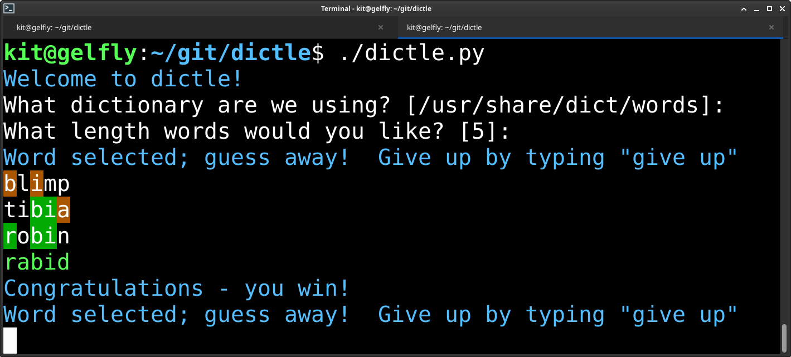

# dictle

Console implementation of a wordle-style game.  Uses the system dictionary (or
any other dictionary you want) and supports any word length.

An example screenshot:

## Things you might like

- user-specified dictionaries (e.g., non-American, or non-English)
- no guess limit
- any word length
- uses your terminal, not a web browser
- colors
- source code
- donut

## Limitations

Input dictionaries are filtered to exclude proper nouns and words with
non-alphabetical characters (which also means that possessives formed with
"'s" are not included either).  The implementation works on English and many
other languages.  However, I know in German it would exclude all nouns
(they're capitalized), and I think it's proably broken for Turkish and any
other language where the capitalized/lowercase distionction doesn't exist or
doesn't work like English's does.

While I don't speak these languages and therefore lack the ability to fix
this, any affected users are encouraged to submit patches or suggestions for
improvement in this area.
